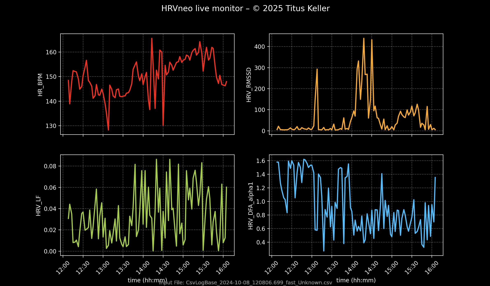

# HRVneo Live Monitor 🫀📊

A real-time heart rate variability (HRV) monitor for neonatal ECG data – developed for clinical and research use in extremely preterm infants.

This tool was created and used in the study:

> **Decoding Autonomic Balance in ELGANs: HRV Signatures Before, During, and After Kangaroo Care**  
> Keller, T. et al. (2025) – submitted to *npj Digital Medicine*

---

## 🌟 What this tool does

- 📡 **Processes raw ECG data** (e.g., from standard NICU monitors)
- 🧠 **Calculates HRV parameters** in real time, including:
  - Time-domain: HR, RMSSD  
  - Frequency-domain: LF power  
  - Nonlinear: DFA α1 (fractal), SD1/SD2
- 🔥 **Live visualizations** of HRV trends (4 panels)
- 📁 **Generates output files**:
  - Chunk-wise HRV CSV summary  
  - Final PDF report including plots and parameter statistics

---

## 📂 File overview

| File | Description |
|------|-------------|
| `live_HRV_monitor_V8_GitHub.py` | Main script – real-time HRV monitor |
| `example_data.csv` | Sample RR-interval recording (for simulation/testing) |
| `requirements.txt` | Python dependencies |
| `README.md` | This file – documentation and usage instructions |

---

## ▶️ How to use

### 1. **Install dependencies**
This project uses Python ≥ 3.8.

Install required packages:
```bash
pip install -r requirements.txt
```

### 2. **Run the monitor**
Use your own ECG `.csv` file (e.g., `ID123_fast_Unknown.csv`) or the provided example:
```bash
python live_HRV_monitor_V8_GitHub.py
```

You will be asked to enter an ID (e.g., `ID007`) to label the session.  
Results will be saved in `/results_newengine/ID007/` as `.csv` and `.pdf`.

---

## 💡 Features

- Works with standard NICU ECG recordings (no special hardware needed)
- Compatible with Polar H10–derived RR recordings (with conversion)
- Outputs clean, intuitive plots and a summary PDF
- Fully written in Python using open-source libraries (e.g., NeuroKit2, matplotlib)

---

## 📊 Example output

<p align="center">
  
</p>


---

## 📄 Citation

If you use this tool in your research or clinical setting, please cite:
```bibtex
@article{keller2025hrv,
  title={Decoding Autonomic Balance in ELGANs: HRV Signatures Before, During, and After Kangaroo Care},
  author={Keller, Titus et al.},
  journal={npj Digital Medicine},
  year={2025},
  note={submitted}
}
```

---

## 🙌 Acknowledgements

This tool was developed as part of a neonatal HRV research initiative led by Dr. Titus Keller.  
We welcome clinical collaborators and data-driven minds to improve and extend this work.

---

## 📬 Contact

For questions or collaborations, please contact:

**Titus Keller, MD**  
Neonatal Intensive Care Unit  
University Hospital Cologne, Germany  
📧 titus.keller@uk-koeln.de

---

> 🛠️ _Making the invisible visible – real-time HRV for the smallest patients._
